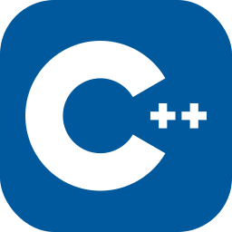

Hi  My name is Aryan barbate
======================================================================================================================================

A Passionate Future Full Stack Developer
----------------------------------------

I'm a 2nd Diploma student in Information Technology, committed to developing strong technical fundamentals and building a long-term career in software dev. I'm passionate about learning new technologies and collaborating with creative minds.

* 🌍  I'm based in Rajgurunagar, Pune, Maharashtra, India
* ✉️  You can contact me at [aryanbarbate3@gmail.com](mailto:aryanbarbate3@gmail.com)
* 🧠  I'm currently learning Python, Java, JavaScript and Figma
* 👥  I'm looking to collaborate on Open Source Projects
* 🧩 When I'm not debugging, you'll find me studying Japanese 🎌, playing Chess ♟️, or catching up on Anime 📺.

  
  
   
  
  
  
  
   
   
  
    
  
  

### Socials

 <a href="https://www.github.com/Aryan-Barbate" target="_blank" rel="noreferrer"> <picture> <source media="(prefers-color-scheme: dark)" srcset="https://raw.githubusercontent.com/danielcranney/readme-generator/main/public/icons/socials/github-dark.svg" /> <source media="(prefers-color-scheme: light)" srcset="https://raw.githubusercontent.com/danielcranney/readme-generator/main/public/icons/socials/github.svg" />  </picture> </a> <a href="https://www.threads.net/@barbate_aryan" target="_blank" rel="noreferrer"> <picture> <source media="(prefers-color-scheme: dark)" srcset="https://raw.githubusercontent.com/danielcranney/readme-generator/main/public/icons/socials/threads-dark.svg" /> <source media="(prefers-color-scheme: light)" srcset="https://raw.githubusercontent.com/danielcranney/readme-generator/main/public/icons/socials/threads.svg" />  </picture> </a> <a href="https://www.linkedin.com/in/aryan-barbate-b653b9393" target="_blank" rel="noreferrer"> <picture> <source media="(prefers-color-scheme: dark)" srcset="https://raw.githubusercontent.com/danielcranney/readme-generator/main/public/icons/socials/linkedin-dark.svg" /> <source media="(prefers-color-scheme: light)" srcset="https://raw.githubusercontent.com/danielcranney/readme-generator/main/public/icons/socials/linkedin.svg" />  </picture> </a>

