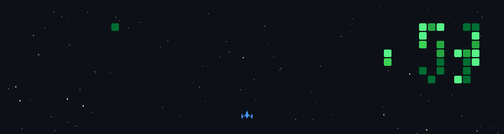

  

<table>
  <tr>
    <td width="50%" align="center">
      
    </td>
    <td width="50%" valign="top">
      <h2>👨‍💻 <samp>About Me</samp></h2>
      

        I am a <b>2nd Year IT Diploma Student</b> from Pune, committed to building strong technical fundamentals. 
        I believe in learning by doing—breaking code, fixing it, and repeating the process.
      

       
      <ul>
        <li>🌱 <b>Currently Learning:</b> Python, Java, & Japanese 🎌</li>
        <li>🧩 <b>Hobbies:</b> Playing Chess ♟️, Watching Anime 📺, and Listening Music 🎶</li>
        <li>👯 <b>Looking for:</b> Open Source collaborations</li>
        <li>📫 <b>Contact:</b> <a href="mailto:aryanbarbate3@gmail.com">aryanbarbate3@gmail.com</a></li>
      </ul>
       
      
      
    </td>
  </tr>
</table>

---

  <h3>🛠️ The Arsenal</h3>
  
<b>Languages & Frameworks</b>

  
  
    
  
  
<b>Tools & Environment</b>

  

---

  <h3>📊 GitHub Analytics</h3>
   
  
  
  

  

---

  <h3>👾 Galactic Bug Hunter</h3>
  
<i>"Visual footage of me aggressively handling merge conflicts and syntax errors."</i>

  
  
  

---

  

    
    
    
  

  
<i>"Quietly learning. Building consistently."</i>

